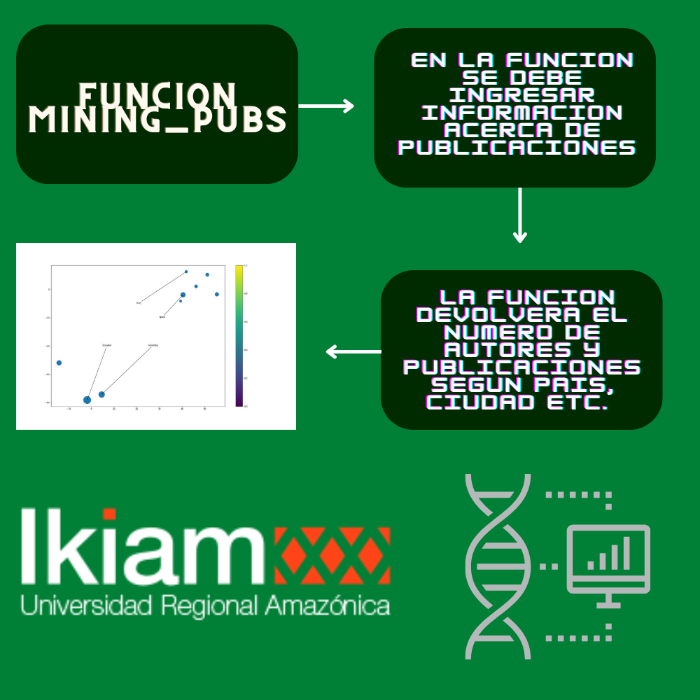

# Datos personales
- ***Mateo Andrei Fernández Valverde***
- ***Sexto Semestre***
- ***Ingenieria en Biotecnologia***
- ***Bioinformatica***
# Caracteristicas del computador
- Procesador:	AMD Ryzen 3 4300U
- Grafica:	Radeon Graphics 2.70 GHz
- RAM instalada:	4,00 GB (3,36 GB utilizable)
- Windows:	Windows 10 Home Single Language
- Version: 21H2
- # Versiones de programas y paquetes
- Python 3.10 (64 bit)
- Anaconda Navigator 2.2.0
- Jupyter Notebook 6.4.8
- Biopython 1.79
- csv 1.0
- re 2.2.1
- pandas 1.4.2
- numpy 1.21.5
- matplotlib 3.5.1
- seaborn 0.11.2
# Versiones de programas y paquetes
- **La data utilizada fue descagada con la funcion download_pubmed en el caso de los primeros literales. La funcion
descargaba desde la base de datos de pubmed informacion sobre articulos que contengan la palabra clave ingresada.
En la informacion se encontraba desde el registro, autores, ciudad, paises, etc.**
- **La segunda data utilizada se descargo desde la base de batos del NCBI. La Accession List se descargo directamente
 desde la pagina web y porterior se descago las secuencias individuales des el python para alinearse y ser graficadas**
 # Un diagrama de procesos del módulo miningscience

